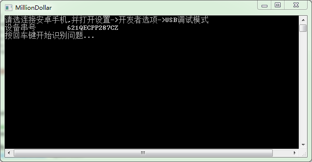
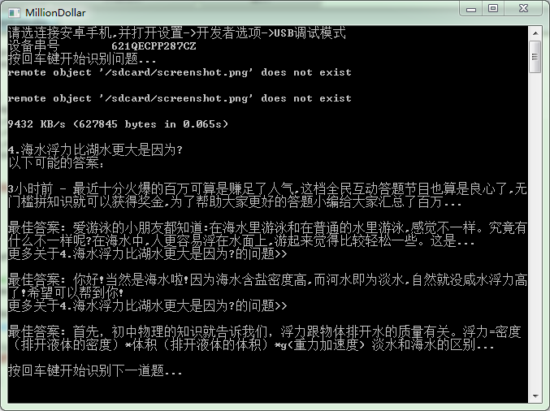

# million-hero
百万英雄，自动搜题程序

**最近全民答题比较火爆，比如百万英雄，冲顶大会，芝士超人等，让普通民众也感受了一把心跳。**

> 本程序参考了一下，最近比较火的跳一跳的原理
1. 安卓手机调试模式
2. 截图
3. 截取文字部分
4. ORC文字识别
5. 调用百度，返回查询结果

- 现隆重介绍一下实现的语言工具 [AARDIO](http://bbs.aardio.com/) 一位国内老程序员开发的语言。[介绍点这里](http://bbs.aardio.com/portal.php?mod=view&aid=5)
- 引用官方的介绍
> aardio 专用于桌面软件快速开发，开发环境仅 6.5 MB, 绿色软件解压即用 -  无论个人或企业都可以永久免费使用本软件开发商用、或非商用的应用程序。使用aardio开发的软件不需要放置鸣谢链接、不需要声明使用aardio开发。 

- 讲真aardio非常强大，很实用，入门简单，比python、node来说简单不少，非常适合开发windows程序

**使用方法如下**
1. 开启usb调试模式安卓手机一部
2. 安装ADB调试驱动 [下载]http://www.wmzhe.com/soft-39913.html
3. 配置windows环境变量，把adb解压完整目录名加入PATH
4. 双击运行MillionDollar.exe

- 手机连接成功如上图显示，否则就去看看adb调试相关的连接知识，这里就不多做介绍

- 根据提示，当题目出现后，按下回车开始识别搜题

- 程序会去百度查询，返回前几条数据直接显示
- 之后我不用我介绍了，多练习练习反应能力
- 祝大家中大奖吧
